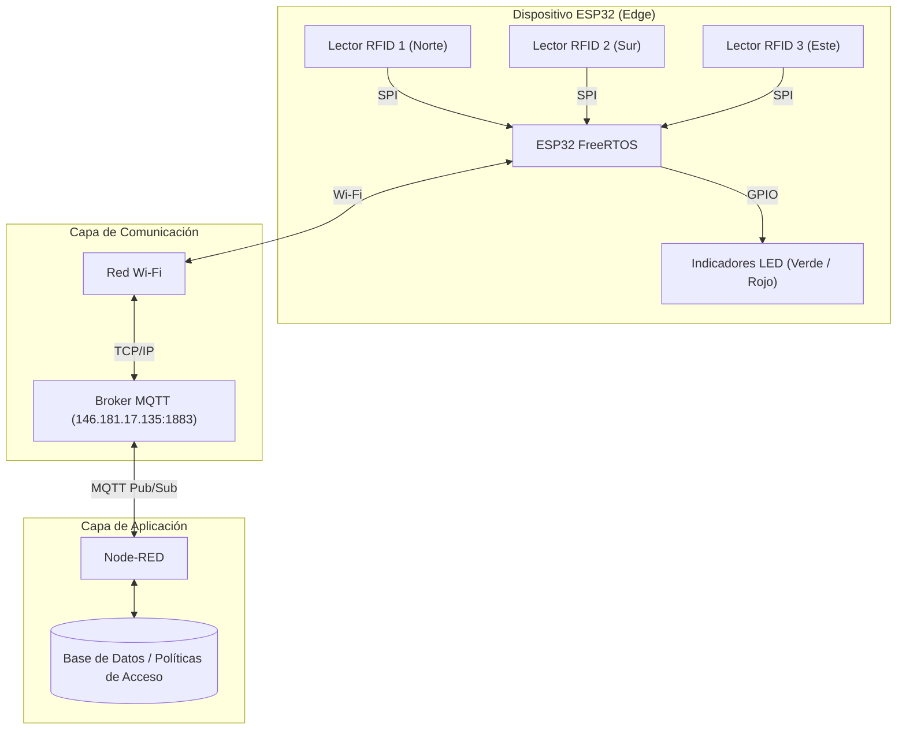

# Sistema de Control de Acceso IoT y Telemetría con ESP32

[](https://platformio.org/)
[](https://www.arduino.cc/)
[](https://wokwi.com/projects/476779594171831297)
[](https://mqtt.org/)
[](https://nodered.org/)

Sistema embebido para control de acceso automatizado mediante tarjetas **RFID (RC522)** gestionado por un microcontrolador **ESP32** bajo **FreeRTOS**. El sistema reporta lecturas a un backend centralizado sobre **Node-RED** utilizando el protocolo de mensajería ligera **MQTT**, incorporando además un mecanismo de contingencia (*Modo Caché Offline*) para operar de forma autónoma ante caídas de conectividad.

---

## 📑 Tabla de Contenidos
1. [Características Principales](#-características-principales)
2. [Arquitectura del Sistema](#-arquitectura-del-sistema)
3. [Mapeo de Hardware y Conexiones](#-mapeo-de-hardware-y-conexiones)
4. [Protocolo de Comunicación MQTT](#-protocolo-de-comunicación-mqtt)
5. [Lógica de Operación](#-lógica-de-operación)
6. [Estructura del Proyecto](#-estructura-del-proyecto)
7. [Instalación y Puesta en Marcha](#-instalación-y-puesta-en-marcha)
8. [Simulación en Wokwi](#-simulación-en-wokwi)

---

## 🚀 Características Principales

* **Multitarea con FreeRTOS:** Ejecución distribuida en los dos núcleos del ESP32:
  * **Core 0:** Administración de red Wi-Fi, reconexión automática y ciclo de cliente MQTT.
  * **Core 1:** Escaneo de lectores RFID y control de actuadores/indicadores LED.
* **Telemetría e Integración con Node-RED:** Envío en tiempo real de UID y puerta asociada para validación remota, registro de eventos y auditoría.
* **Alta Disponibilidad (Caché Offline):** En caso de pérdida de enlace Wi-Fi o caída del broker MQTT, el sistema conmuta automáticamente a validación de credenciales maestras almacenadas localmente.
* **Escalabilidad Multilector:** Preparado para gestionar múltiples accesos compartiendo el bus SPI con líneas *Chip Select* (SDA/SS) independientes.
* **Simulación Virtual:** Totalmente integrado con el simulador Wokwi mediante `diagram.json` y `wokwi.toml`.

---

## 🏛 Arquitectura del Sistema



---

## 🔌 Mapeo de Hardware y Conexiones

### 1. Bus SPI Compartido (Lectores RC522)
| Señal RC522 | Pin ESP32 | Descripción |
| :--- | :---: | :--- |
| **SCK** | GPIO 18 | Reloj SPI compartido |
| **MOSI** | GPIO 23 | Master Out Slave In |
| **MISO** | GPIO 19 | Master In Slave Out |
| **RST** | GPIO 4 | Pin de reinicio compartido |
| **3.3V** | 3V3 | Alimentación lógica (3.3V) |
| **GND** | GND | Tierra común |

### 2. Selectores de Esclavo (SS / SDA) y LEDs por Puerta
| Puerta / Ubicación | Pin SS (SDA) | LED Verde (Acceso Concedido) | LED Rojo (Acceso Denegado) |
| :--- | :---: | :---: | :---: |
| **Puerta 1 (Norte)** | GPIO 5 | GPIO 12 | GPIO 13 |
| **Puerta 2 (Sur)** | GPIO 21 | GPIO 25 | GPIO 26 |
| **Puerta 3 (Este)** | GPIO 27 | GPIO 32 | GPIO 33 |

---

## 📡 Protocolo de Comunicación MQTT

* **Broker:** `146.181.17.135`
* **Puerto:** `1883` (Sin SSL)

### 1. Publicación (ESP32 ➔ Node-RED)
* **Tópico:** `esp32/rfid`
* **Formato:** JSON
* **Ejemplo de Payload:**
  ```json
  {
    "puerta": "norte",
    "uid": "01020304"
  }
  ```

### 2. Suscripción (Node-RED ➔ ESP32)
* **Tópico:** `esp32/respuesta`
* **Formato:** Cadena de texto delimitada por comas (`<accion>,<puerta>`)
* **Valores posibles:**
  * `"permitido,norte"` ➔ Enciende LED Verde (GPIO 12) por 3 segundos.
  * `"denegado,norte"` ➔ Enciende LED Rojo (GPIO 13) por 3 segundos.

---

## ⚙️ Lógica de Operación

1. **Modo Online (Conectado):**
   * El lector detecta una tarjeta y lee su UID hexadecimal.
   * Empaqueta el UID y la puerta en formato JSON y lo publica al tópico `esp32/rfid`.
   * El ESP32 espera la respuesta de Node-RED por el tópico `esp32/respuesta` para activar el actuador correspondiente (LED Verde o Rojo).

2. **Modo Offline / Caché (Sin Red):**
   * Si la conexión Wi-Fi o MQTT se interrumpe, el sistema entra en modo de contingencia.
   * La tarjeta es comparada contra la lista de UIDs autorizados en la memoria del microcontrolador (ej. Llave Maestra `01020304`).
   * Si coincide, se otorga acceso localmente (LED Verde). En caso contrario, se deniega (LED Rojo).
   * Paralelamente, una tarea en segundo plano intenta la reconexión periódica sin bloquear la lectura física.

---

## 📂 Estructura del Proyecto

```text
telematicos/
├── .pio/                 # Archivos temporales de compilación (ignorado en git)
├── .vscode/
│   └── extensions.json   # Extensiones recomendadas para VS Code
├── docs/                 # Documentación adicional y diagramas
├── include/              # Cabeceras y configuraciones (.h)
├── lib/                  # Librerías personalizadas del proyecto
├── src/
│   └── main.cpp          # Código fuente principal del firmware
├── test/                 # Pruebas unitarias
├── .gitignore            # Reglas de exclusión de control de versiones
├── diagram.json          # Diagrama de cableado para simulación Wokwi
├── platformio.ini        # Configuración de PlatformIO y dependencias
├── README.md             # Documentación principal del repositorio
└── wokwi.toml            # Configuración de ejecución del simulador Wokwi
```

---

## 🛠️ Instalación y Puesta en Marcha

### Prerrequisitos
1. [Visual Studio Code](https://code.visualstudio.com/)
2. Extensión **PlatformIO IDE** instalada en VS Code.
3. Extensión **Wokwi Simulator** instalada en VS Code.

### Pasos para compilar
1. Clona este repositorio o abre la carpeta del proyecto en VS Code:
   ```bash
   git clone https://github.com/ChAndres05/NODE-RED-PARA-INTEGRACI-N-DE-SERVICIOS-IOT.git
   ```
2. PlatformIO descargará automáticamente las dependencias definidas en `platformio.ini`:
   * `PubSubClient @ ^2.8`
   * `MFRC522 @ ^1.4.11`
3. Para compilar el proyecto, presiona `Ctrl + Alt + B` o ejecuta en la terminal:
   ```bash
   pio run
   ```

---

## 🌐 Simulación en Wokwi

El proyecto puede simularse de dos formas:
1. **Directamente en el navegador:**
   * Abre el enlace público del proyecto: [Simulación Wokwi Telemáticos](https://wokwi.com/projects/476779594171831297).
2. **Dentro de VS Code con la extensión Wokwi:**
   * Abre el archivo `diagram.json` en VS Code.
   * Presiona `F1` y selecciona `Wokwi: Start Simulator`.

