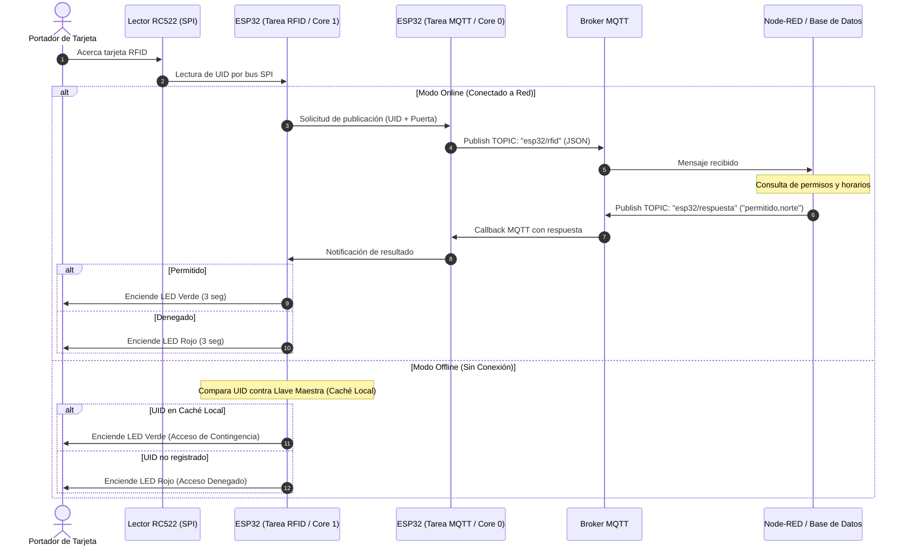

# Documentación Técnica: Protocolos, Tareas FreeRTOS y Flujos

Esta guía complementa la arquitectura general del proyecto, detallando el ciclo de vida de las tareas en FreeRTOS, los protocolos de comunicación y el flujo de datos entre el **ESP32**, el **Broker MQTT** y **Node-RED**.

---

## 1. Diagrama de Secuencia: Flujo de Validación de Acceso

El flujo de información sigue un modelo de solicitud y respuesta asíncrona desacoplado por el broker MQTT:



---

## 2. Especificación de Mensajería MQTT

### A. Tópico `esp32/rfid` (Publicación)
Utilizado para reportar lecturas físicas ocurridas en cualquiera de las puertas controladas por el ESP32.

* **Dirección:** ESP32 ➔ Broker ➔ Node-RED
* **QoS:** 0 (o 1 para entrega garantizada)
* **Content-Type:** `application/json`
* **Esquema JSON:**
```json
{
  "$schema": "http://json-schema.org/draft-07/schema#",
  "title": "LecturaRFID",
  "type": "object",
  "properties": {
    "puerta": {
      "type": "string",
      "enum": ["norte", "sur", "este"],
      "description": "Identificador textual de la puerta donde se leyó la tarjeta"
    },
    "uid": {
      "type": "string",
      "pattern": "^[0-9A-F]{8,14}$",
      "description": "Identificador único de la tarjeta RFID en formato hexadecimal en mayúsculas"
    }
  },
  "required": ["puerta", "uid"]
}
```

### B. Tópico `esp32/respuesta` (Suscripción)
Utilizado por Node-RED para notificar al ESP32 si la solicitud fue aprobada o rechazada.

* **Dirección:** Node-RED ➔ Broker ➔ ESP32
* **QoS:** 0
* **Formato:** Texto plano CSV: `<resultado>,<puerta>`
* **Campos:**
  * `<resultado>`: `permitido` o `denegado`
  * `<puerta>`: `norte`, `sur`, `este`
* **Ejemplos:**
  * `permitido,norte`
  * `denegado,sur`

---

## 3. Modelo de Concurrencia con FreeRTOS

Para garantizar que la lectura física de tarjetas nunca se bloquee debido a latencias de red o caídas de Wi-Fi, el firmware aprovecha la arquitectura de doble núcleo del microcontrolador Xtensa LX6 del ESP32:

```text
               +-------------------------------------------------+
               |                   ESP32 MCU                     |
               |                                                 |
               |   [NÚCLEO 0: Protocolos de Red]                 |
               |   - Tarea Red & MQTT (Prioridad 1)              |
               |     * WiFi.begin() / Reconexión continua        |
               |     * client.loop() y recepción de mensajes     |
               |     * Despacho de comandos hacia actuadores     |
               |                                                 |
               |   [NÚCLEO 1: Control de Hardware en Tiempo Real]|
               |   - Tarea Escaneo RFID (Prioridad 1)            |
               |     * Sondeo cíclico de los lectores RC522      |
               |     * Lectura de registros SPI                  |
               |     * Control de temporización de LEDs          |
               |     * Evaluación de caché local si offline      |
               +-------------------------------------------------+
```

### Mecanismo de Comunicación Segura entre Núcleos
Para evitar problemas de condición de carrera (*race conditions*) sobre el cliente `PubSubClient`, se recomienda el uso de una **Cola de FreeRTOS (`QueueHandle_t`)**:
* La tarea de RFID deposita una estructura con `{puerta, uid}` en la cola.
* La tarea de MQTT extrae los elementos de la cola y realiza el `client.publish()` dentro del mismo contexto de ejecución de red.

